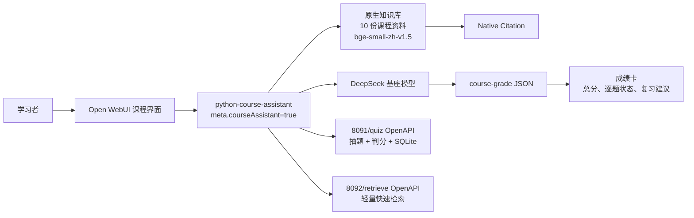

# 架构与调用链

1. 仅 `meta.courseAssistant=true` 渲染课程欢迎页、三张学习卡和输入区课程快捷入口。
2. 知识型问题通过原生 `query_knowledge_files`/`kb_exec` 主检索，8092 作为可展示、可快速调用的自定义扩展。
3. 练习请求调用 8091 的生成接口；答案请求调用判分接口；模型在 Markdown 说明后追加 `course-grade`。
4. 前端只在课程模型解析该块。合法块移除 JSON 后展示成绩卡；不合法或缺失时完整保留普通 Markdown。

颜色语义：靛蓝/紫色表示课程入口，青绿表示正确，琥珀表示漏答或待复习，红色表示错误。
